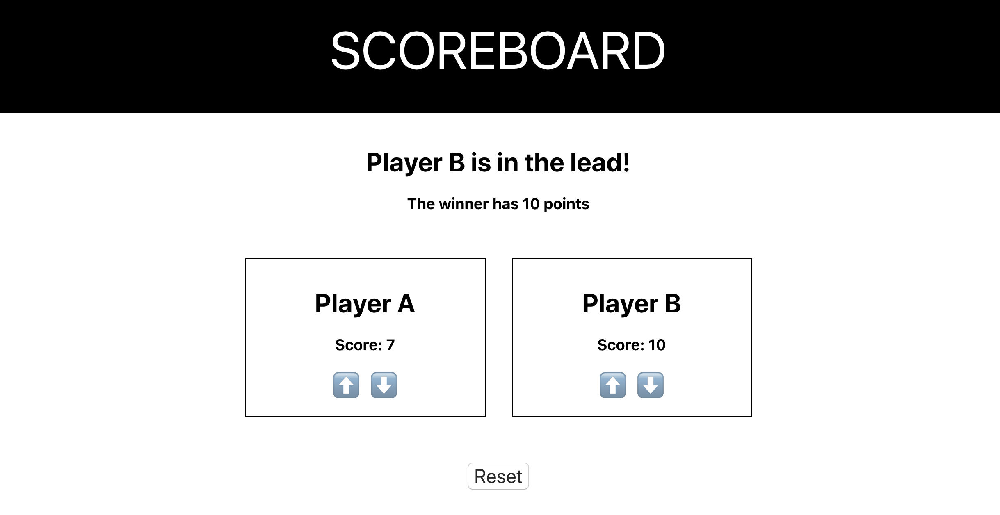

# Scorekeeper React App

## The Goal

You're going to build an app that allows you to keep track of player scores in real time. You may have seen something like this at some point - Class Dojo is fairly similar. But this one will be built from scratch, and it'll be all yours.

## Getting Started

1. Clone this repository using `git clone`
2. `cd` into the project folder
3. `npm install`
4. `npm start`

## The Lab

#### 1. Add Player B

Right now the lab only keeps track of a single player. Add a "Player B" component to the app.

#### 2. Make Player B Work

If you don't create new functions and modify the state's initial setup, Player B's buttons won't work.

#### 3. Make Down Arrows Work

Currently only the up arrows work for each player. Have the down arrows decrease the score by 1 every time they are clicked.

#### 4. Current Winner

Show the current winner in the App.

> Consider also how you might show a "?" when there is a tie.

#### 5. Winning Score

Show the current high score in the App.

## Extensions

#### 6. Refactoring

Consolidate the `handlePlayerAClick` and `handlePlayerBClick` functions to be a single function called `handlePlayerClick`.

> The event handler in `player.js` is `onClick={()=>props.clickHandler()}`. One strategy is to add additional information as an argument of the `clickHandler` function: `onClick={()=>props.clickHandler(props.id)}`. You could then rewrite the function definition of `const handlePlayerAClick = ()` with a parameter like `const handlePlayerAClick = (id)`. There are other ways to accomplish this, too.

#### 7. Optimization

Store the scores more efficiently - an array or an object could both make the processes of changing scores and identifying a high score and a current winner a lot easier.

> Hint: Explore JavaScript methods that will help you find the maximum value of an array or an array of objects. You might also look for a way to identify the index of the element with that maximum value.

#### 8. Expansion

Modify the game to work for between 4 and 10 players.

#### 9. User Interface #1

Add a reset button.
Think about how your reset button will work. Will it reset the app back to two players with scores of 0? or will it retain the number of players and reset all scores to 0?

#### 10. User Interface #2

Add an "add player" and a "remove player" button.

> Do you want there to be a maximum number of players allowed?
